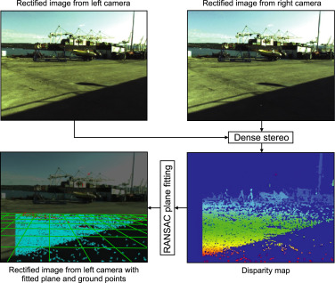

# Quick StereoCamera-IMU Calibration
A Quick and Effective StereoCamera-IMU Calibration for MODD2 dataset, written in Matlab.
https://doi.org/10.1016/j.robot.2018.02.017 (Section 3.3)

Requirements: Matlab2016a+ with OpenCV3.0+ library

There are two main functions: <i>getGroundPlane</i> and <i>getVanishingPoints</i>

### getGroundPlane:
This function fits a plane on the ground points located in-front-of the USV and reads the initial rotations provided by the on-board IMU. From this we can obtain two rotation matrices (1) R_{CAM}^{USV} (rotation from the camera coordinate system to the USV coordinate system) and (2) R_{IMU}^{USV} (rotation from the IMU coordinate system to the USV coordinate system).

[]

### getVanishingPoints:
This function reads current measurements of the IMU. Based on this measurements (and R_{IMU}^{USV}) it rotates the points in infinity, defined in the IMU coordinate system, to the world coordinate system. By projecting the selected points from the world coordinate to the camera plane we are able to obtain the approximate location of the horizon line.

### Running the demo
To run the example calibration simply call the <i>demo_calibration.m</i> script. The script expects two input parameters: (1) path to the root directory of the MODD2 dataset and (2) sequence ID (a number from interval [1..28]). The demo script will perform Camera-IMU calibration and estimate the horizon location for each image, based on the IMU measurements. Example function call:
```
demo_calibration('../MarineDatasets/MODD2', 14)
```

### Horizon estimation results
Results obtained on <a href="https://github.com/bborja/modd">MODD2 dataset</a> with the provided code. Horizon estimation results can be further improved with a more effective plane-fitting. Click on the below image to see the whole video.

[](http://www.youtube.com/watch?v=YbiXGpxz0hY "A Quick and Effective Camera-IMU Calibration (Results)")


### Cite
If you use the provided code, please cite our paper:
```
@article{bovcon2018stereo,
  title={Stereo obstacle detection for unmanned surface vehicles by IMU-assisted semantic segmentation},
  author={Bovcon, Borja and Per{\v{s}}, Janez and Kristan, Matej and others},
  journal={Robotics and Autonomous Systems},
  volume={104},
  pages={1--13},
  year={2018},
  publisher={Elsevier}
}
```
